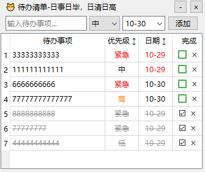

#项目所有内容均通过Cursor通过自然语言对话生成
# TodoList Desktop Widget

一个简洁美观的桌面待办事项小部件，帮助你更好地管理日常任务。

## 功能特点

- 💫 简洁的界面设计，支持拖拽和大小调整
- 📝 快速添加和管理待办事项
- 🎯 支持优先级设置（紧急/高/中/低）
- 📅 任务截止日期管理
- ✅ 任务完成状态追踪
- 🔄 自动保存数据
- 🚀 开机自启动
- 🎨 优雅的动画效果
- 📊 支持按优先级和日期排序

## 安装说明

1. 确保你的系统已安装 Python 3.6 或更高版本
2. 安装所需依赖：

pip install PyQt6 pywin32

## 使用方法

### 基本操作

1. **添加任务**
   - 在输入框中输入任务内容
   - 选择优先级（紧急/高/中/低）
   - 设置截止日期
   - 点击"添加"按钮

2. **管理任务**
   - 勾选复选框标记任务完成
   - 点击"×"按钮删除任务
   - 点击表头可按优先级或日期排序

3. **窗口操作**
   - 拖拽标题栏移动窗口
   - 拖拽右边框或底部边框调整窗口大小
   - 点击最小化按钮最小化窗口
   - 点击关闭按钮关闭程序

### 特殊功能

- **自动保存**: 所有操作都会自动保存
- **过期提醒**: 已过期的任务日期会以红色显示
- **任务排序**: 已完成的任务会自动移到列表底部

## 数据存储

- 任务数据保存在程序所在目录的 `todo_data.json` 文件中
- 程序会自动创建和管理数据文件
- 数据格式采用 JSON 存储，方便备份和迁移

## 注意事项

- 程序需要管理员权限以设置开机自启动
- 建议定期备份 `todo_data.json` 文件
- 如遇到界面显示异常，可以尝试重启程序

## 技术支持

如果你在使用过程中遇到任何问题，请提交 Issue。

## 许可证

本项目采用 MIT 许可证。
